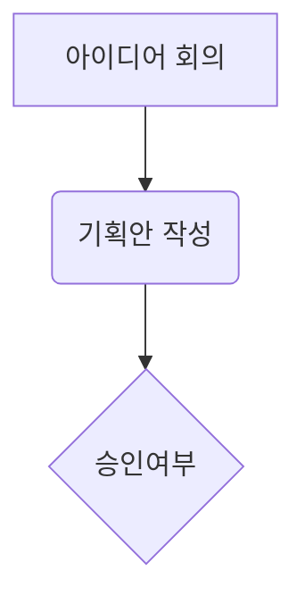

# 제목 1
## 제목 2
### 제목 3

**중요 내용 강조 => ** 로 감싸기** 

*이태리체(asterisk)*   
_이태리체(언더바)_  
~~취소선~~

- 하이픈, asterisk 으로 bullet 생성  

내용을 기록하고 Tab으로 하위 항목 생성  


1. 첫 번째
3. 다섯 번째
4. 세 번째
5. 네 번째

[논문 해석 링크](https://www.themoonlight.io/paper/eda71fa4-869b-4848-afd1-fa74adaa9dbd)


> 인용구 1 (>) 사용
>> 인용구 2(>>) 사용

---
문단 분리
---

```
회색 음영 박스 생성
```

| 이름 | 나이 | 성별 |  
|---|---|---|  
| 권세현| 24 | 남 |

[ ]   
[x]


